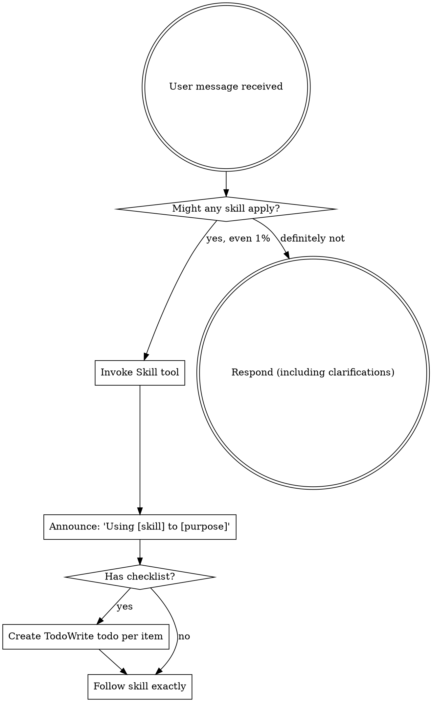

<EXTREMELY-IMPORTANT>
If you think there is even a 1% chance a skill might apply to what you are doing, you ABSOLUTELY MUST invoke the skill.

IF A SKILL APPLIES TO YOUR TASK, YOU DO NOT HAVE A CHOICE. YOU MUST USE IT.

This is not negotiable. This is not optional. You cannot rationalize your way out of this.
</EXTREMELY-IMPORTANT>

## How to Access Skills

**In Claude Code:** Use the `Skill` tool. When you invoke a skill, its content is loaded and presented to you—follow it directly. Never use the Read tool on skill files.

**In other environments:** Check your platform's documentation for how skills are loaded.

# Using Skills

## The Rule

**Invoke relevant or requested skills BEFORE any response or action.** Even a 1% chance a skill might apply means that you should invoke the skill to check. If an invoked skill turns out to be wrong for the situation, you don't need to use it.

**执行示例**：

```
收到消息："帮我排查系统超时问题"
步 1: read skills/using-superpowers/SKILL.md  ← 第一动作
步 2: 扫描 available_skills，发现 systematic-debugging 适用
步 3: 宣告 "Using using-superpowers to 任务检查"
步 4: 发现 systematic-debugging 适用 → 宣告 "Using systematic-debugging to 系统超时排查"
步 5: 执行 systematic-debugging 流程
步 6: 响应用户
```



## Red Flags

These thoughts mean STOP—you're rationalizing:

| Thought | Reality |
|---------|---------|
| "This is just a simple question" | Questions are tasks. Check for skills. |
| "I need more context first" | Skill check comes BEFORE clarifying questions. |
| "Let me explore the codebase first" | Skills tell you HOW to explore. Check first. |
| "I can check git/files quickly" | Files lack conversation context. Check for skills. |
| "Let me gather information first" | Skills tell you HOW to gather information. |
| "This doesn't need a formal skill" | If a skill exists, use it. |
| "I remember this skill" | Skills evolve. Read current version. |
| "This doesn't count as a task" | Action = task. Check for skills. |
| "The skill is overkill" | Simple things become complex. Use it. |
| "I'll just do this one thing first" | Check BEFORE doing anything. |
| "This feels productive" | Undisciplined action wastes time. Skills prevent this. |
| "I know what that means" | Knowing the concept ≠ using the skill. Invoke it. |

## Skill Priority

When multiple skills could apply,**按以下绝对顺序排列**：

| 优先级 | 类型 | 示例 skill | 决策规则 |
|--------|------|-----------|---------|
| **P0** | Process skills | brainstorming, debugging, systematic-debugging | **先跑**，决定解题方向 |
| **P1** | Implementation skills | frontend-design, mcp-builder, code-generator | **后跑**，执行方向决定的操作 |

**强制规则**：
- "Let's build X" → **brainstorming（process）先于 implementation**
- "Fix this bug" → **systematic-debugging 或 debugging 先于任何 domain skill**
- 不论任务多小，process skill 和 implementation skill 同时存在时，process 必须先执行
- 只有当无 process skill 可用时，才直接进入 implementation skill

## Skill Types

**Rigid** (TDD, debugging): Follow exactly. Don't adapt away discipline.

**Flexible** (patterns): Adapt principles to context.

The skill itself tells you which.

## User Instructions

Instructions say WHAT, not HOW. "Add X" or "Fix Y" doesn't mean skip workflows.

---

## 异常与边界条件

**dim3 失败模式编码 — 必须显式编码以下分支：**

| 触发条件 | 一线修复 | 仍失败兜底 |
|---------|---------|----------|
| Skill 工具不存在 | 改用 read 工具直接读取 SKILL.md，并在宣告中说明 | 跳过 skill 流程，继续主任务（不可阻塞） |
| Skill 文件路径错误/不存在 | 用 find 搜索全盘 `skills/*/SKILL.md` | 告知用户 skill 未找到，不执行 |
| 多个 skill 同时适用 | 按 Skill Priority 顺序（process > implementation）选择第一个 | 全部检查后选最具体的 |
| Skill 描述与当前任务无关 | 继续执行主任务，不强制使用 | 在响应末尾追加「注：相关 skill 未找到」 |
| 收到心跳轮询/系统事件 | **也必须执行 skill 检查**，不得跳过 | 如判断无需 invoke任何 skill，直接响应 |

---

## 使用反例黑名单（dim9 — 不要做的事）

| # | 反模式 | 为什么不要做 | 正确做法 |
|---|--------|------------|---------|
| 1 | **在 skill 检查前执行工具调用** | 破坏「先检查后行动」的核心纪律 | 必须先完成 skill 检查五步流程，再执行任何工具 |
| 2 | **用「我记得这个 skill」代替实际读取** | skill 会更新，历史记忆不可靠 | 每次都 read 当前版本的 SKILL.md |
| 3 | **对简单查询跳过 skill 检查** | "简单"不等于「不需要 skill」，心跳轮询也是任务 | 心跳轮询也必须执行 skill 检查 |
| 4 | **同时检查多个 skill 但不按优先级排序** | 多 skill 同时适用时顺序影响结果质量 | 按 process > implementation 顺序 |
| 5 | **用 memory_search 代替 skill 工具** | skill 是主动流程，memory 是被动回忆，不得混用 | 先 invoke skill，skill 内部再决定是否调用 memory |

**触发场景**：每次收到消息后，对照本表一次。任一命中 → 重回五步流程起点。
